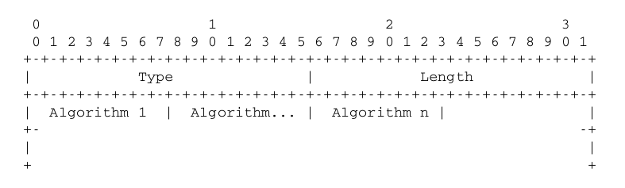
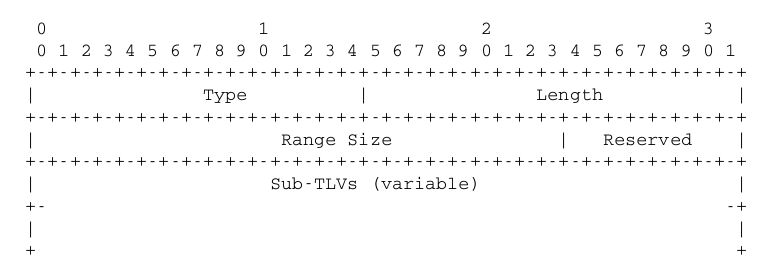
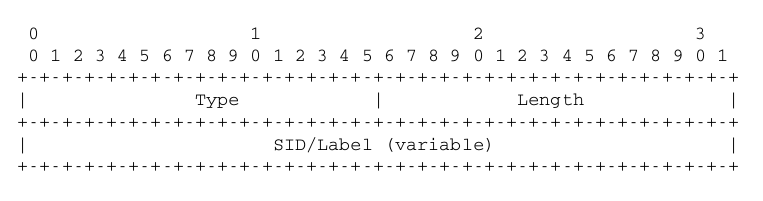

## Introduction

This is a project to develop Wireshark Dissector for "OSPFv3 extensions for Segment Routing". 
IETF draft [draft-ietf-ospf-ospfv3-segment-routing-extensions-06](https://tools.ietf.org/html/draft-ietf-ospf-ospfv3-segment-routing-extensions-06)

## Dissection

OSPF, IS-IS or BGP is used as the control protocols in Segment routing. This dissector deals with one part of OSPF extension needed for segment routing.

Segment Routing uses OSPF Router Information Opaque LSA (Type 12) to propagate Segment ID (SID/Label). Different types of TLVs are defined to carry Segment Routing information. 

Extensions for LSA format has also been proposed to support SID/Label Binding, ERO, Adjacency SID etc. 

  - This project does not deal with the LSA extension. 
  - The dissection is focused on Routing Information Opaque LSA TLV formats

## TLVs under consideration 

> SR-Algorithm TLV

  

> SID/Label Range TLV

 

> SID/Label Sub TLV

 

